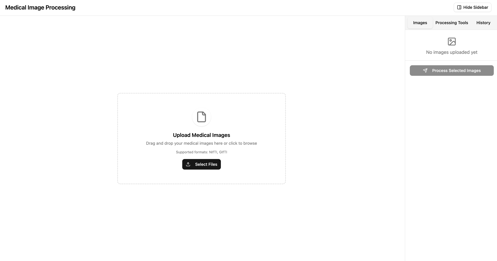
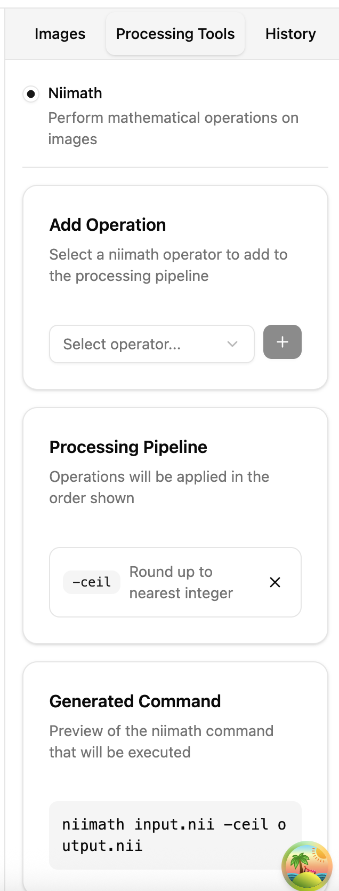
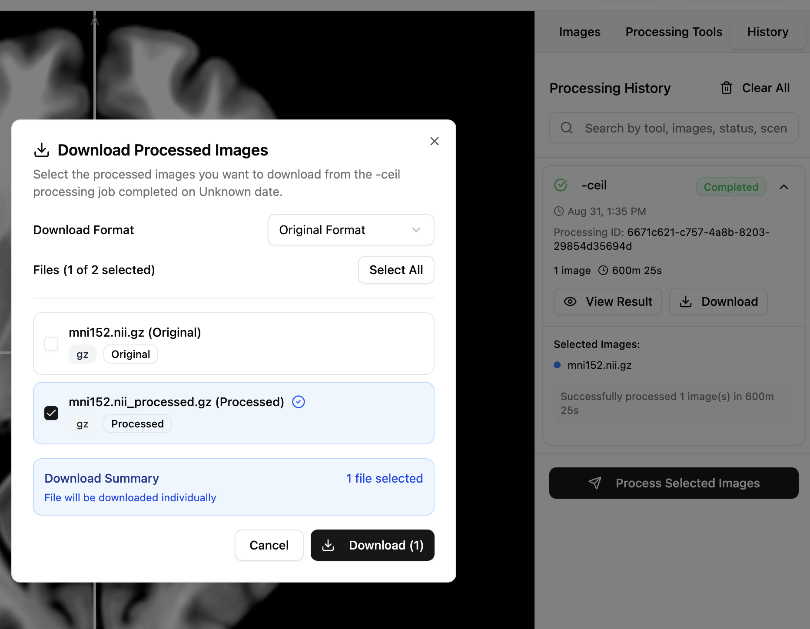

# Fullstack niivue demo App

## Technology Stack and Features

- ⚡️ [**FastAPI**](https://fastapi.tiangolo.com) for the Python backend API.
    - 🧰 [SQLModel](https://sqlmodel.tiangolo.com) for the Python SQL database interactions (ORM).
    - 🔍 [Pydantic](https://docs.pydantic.dev), used by FastAPI, for the data validation and settings management.
    - 💾 [PostgreSQL](https://www.postgresql.org) as the SQL database.
    - 🔄 [Alembic](https://alembic.sqlalchemy.org/en/latest/) for database migration.
    - 🔑 [WorkOS](https://workos.com/) for authentication.
    - ⚙️ [Niimath](https://github.com/rordenlab/niimath) for processing.
- ⚛️ [React](https://react.dev) for the frontend.
    - 🩻 [NiiVue](https://niivue.com/) for medical imaging visualization.
    - 🪄 Using TypeScript, Vite, and other parts of a modern frontend stack.
    - 🎨 [shadcn/ui](https://ui.shadcn.com/) for the frontend components.

### Scene - Upload Images

### Scene - Select Processing Tool
<!--  -->

### Scene - View Results

## How To Use It

You can **just fork or clone** this repository and follow the steps belows.

### Configure

You can then update configs in the `.env` files to customize your configurations.

Before deploying it, make sure you change at least the values  in `.env` file for:

- `WORKOS_API_KEY`
- `WORKOS_CLIENT_ID`

### Start the app with Docker

Once setting up the environment variable, you can start the app by running `docker compose watch`.

You can then go to `http://localhost:5173` in the browser, signup and login to use the app.

## Backend Development

Backend docs: [backend/README.md](./backend/README.md).

## Frontend Development

Frontend docs: [frontend/README.md](./frontend/README.md).

## Development

General development docs: [development.md](./development.md).

This includes using local domains, `.env` configurations, etc.

## Deployment

Deployment docs: [infra/README.md](./infra/README.md).

