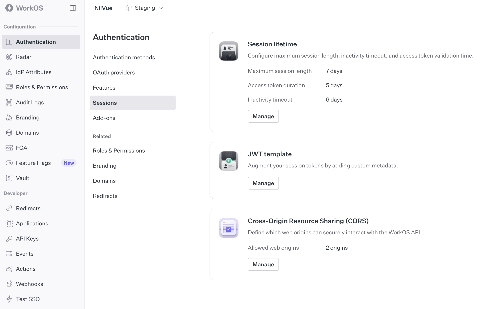

# Fullstack NiiVue Project - Development

## URLs

The production or staging URLs would use these same paths, but with your own domain.

### Development URLs

Development URLs, for local development.

Frontend: http://localhost:5173

Backend: http://localhost:8000

Automatic Interactive Docs (Swagger UI): http://localhost:8000/docs

Automatic Alternative Docs (ReDoc): http://localhost:8000/redoc

## Local Development

## Local setup using Docker 

The quickest and easiest way to get the project running on your local machine is to use [Docker Compose](https://docs.docker.com/compose/). This will let you build and run the backend, frontend and database containers locally.

Requirements:
- Docker

You need to run the following command that will build the Docker images and will run the app while watching for changes on the codebase for hot reloads. 

```bash
docker compose watch
```

To see the app running, open your browser and go to `http://localhost:5173`. 

## Local Setup (Legacy)

Requirements:
- Node.js (for frontend environment)
- npm (for frontend environment)
- pixi (for backend environment)
- git


### frontend

```bash
cd frontend
npm install
```

### backend

```bash
cd backend
pixi install
```

## run the frontend in development mode

```bash
cd frontend
npm run dev
```

## run the backend in development mode

This hot reloads the backend when changes are made to the code.

> Note: the frontend will be "static" in this mode.

```bash
cd backend
pixi run serve
```

## build the frontend for production

```bash
cd frontend
npm run build
```

## Environment Variables

You can set several variables, like:

* `PROJECT_NAME`: The name of the project, used in the API for the docs and emails.
* `STACK_NAME`: The name of the stack used for Docker Compose labels and project name.
* `BACKEND_CORS_ORIGINS`: A list of allowed CORS origins separated by commas.
* `SECRET_KEY`: The secret key for the FastAPI project, used to sign tokens from WorkOS. This is obtained by encoding automatically generated 32 random bytes.
* `FIRST_SUPERUSER`: The email of the first superuser, this superuser will be the one that can create new users.
* `FIRST_SUPERUSER_PASSWORD`: The password of the first superuser.
* `POSTGRES_SERVER`: The hostname of the PostgreSQL server. You can leave the default of `db`, provided by the same Docker Compose. You normally wouldn't need to change this unless you are using a third-party provider.
* `POSTGRES_PORT`: The port of the PostgreSQL server. You can leave the default. You normally wouldn't need to change this unless you are using a third-party provider.
* `POSTGRES_PASSWORD`: The Postgres password.
* `POSTGRES_USER`: The Postgres user, you can leave the default.
* `POSTGRES_DB`: The database name to use for this application. You can leave the default of `app`.
* `SENTRY_DSN`: The DSN for Sentry, if you are using it.

## WorkOS setup

### Cross-Origin Resource Sharing (CORS)
To connect your WorkOS account with the frontend, go to your WorkOS account dashboard, navigate to Authentication on the left sidebar, then choose Sessions on the second sidebar like below.

Click `Manage` in the `Cross-Origin Resource Sharing (CORS)` section and add the origins you want to allow interaction with WorkOS API. Eg. `http://localhost:5173` for local development or your domain in production



### Session lifetime

You can also change the lifetime of the access token stay logged in.